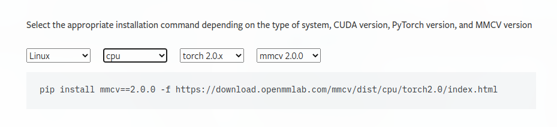
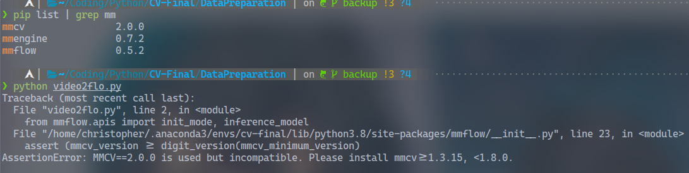
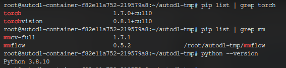

## File Structure

```markdown
.
├── lux                     : [Forked lux](https://github.com/ChrisVicky/lux), compiled to Arch Linux Platform
├── main.py                 : Downloader that wrap `lux` with options
├── README.md           
├── video2gif.py            : Clip downlaed videos to gifs
└── videos                  : directiory for storing
3 directories, 33 files
```
## Video Downloader

* Download Video from Various Video Sources

### Usage
1. Copy your cookies in file `cookies` stored in the current directory
2. RUN `python download.py` to start downloading

## Data Preparation

### ~~CPU Platform~~
<!-- * Fxxk `mm` Project. -->

* !! `mmflow` cannot run on CPU platform because there is no compatible versions of mmcv that support both CPU Platform and mmflow module. They are in conflict when it comes to Platform with only CPU - Torch.

<center>
<br>
<div style="color:orange; border-bottom: 1px solid #d9d9d9;display: inline-block;color: #999;padding: 2px;">The only Supported Version of MMCV is 2.0.0 [1]</div>
</center>
<center>
<br>
<div style="color:orange; border-bottom: 1px solid #d9d9d9;display: inline-block;color: #999;padding: 2px;">Runtime Error [2]</div>
</center>


> * [1] : https://mmcv.readthedocs.io/en/latest/get_started/installation.html#install-mmcv-full
> * [2] : Error Occurs when running under such a Configuration


### CUDA

* When it comes to `CUDA` style of Torch, it works with the following configurations.

<center>
    <br>
    <div style="color:orange; border-bottom: 1px solid #d9d9d9;display: inline-block;color: #999;padding: 2px;">compatible configuration</div>
</center>

